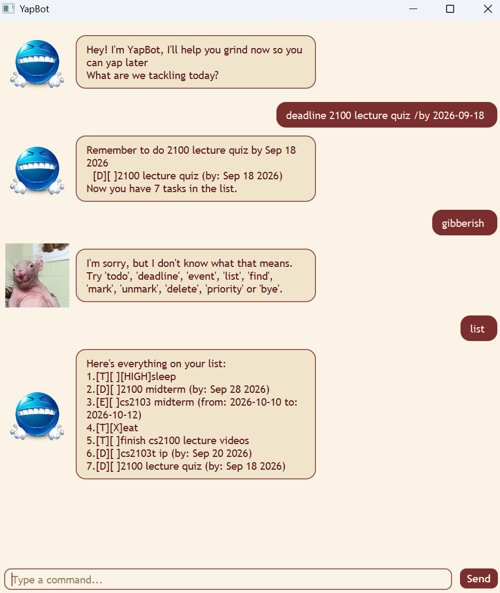

# YapBot User Guide



**YapBot** is a personal task-management chatbot for recording todos,
deadlines, events, priorities, and completed work. It's available through a
JavaFX graphical interface and a console interface, and speaks with a warm,
encouraging tone — think of it as an accountability buddy that celebrates
what you've added and gently reminds you what's due.

## Getting started

YapBot requires **JDK 25**. In IntelliJ IDEA, open the project and run
`yapbot.gui.Launcher` for the graphical interface or `yapbot.YapBot` for the
console interface. In the GUI, enter commands in the text box. In the console,
type a command and press Enter.

To build and run the packaged application on Windows:

```text
gradlew.bat clean shadowJar
java -jar build/libs/yapBot.jar
```

## Look and feel

The GUI uses a maroon-and-cream colour theme, with your messages and
YapBot's replies shown as separate speech bubbles. Every YapBot reply also
shows an avatar icon:

- A cheerful default icon for normal replies (a task was added, listed,
  marked, etc.).
- A "confused" icon whenever your input is rejected — an unrecognized
  command, a duplicate task, an invalid task number, a malformed date, or
  any other validation error.

## Command summary

| Command | Purpose |
| --- | --- |
| `todo <description>` | Add a simple task |
| `deadline <description> /by <date>` | Add a task with a due date |
| `event <description> /from <start> /to <end>` | Add an event |
| `list` | Show all tasks |
| `find <keyword>` | Search task descriptions |
| `mark <number>` | Mark a task as done |
| `unmark <number>` | Mark a task as not done |
| `priority <number> <level>` | Change a task's priority |
| `delete <number>` | Delete a task |
| `bye` | Exit YapBot |

Task numbers are the numbers shown by `list` and start at 1.

## Adding tasks

Add a normal todo:

```text
todo read chapter 3
```

> Great, I've added read chapter 3 to the list

Add a deadline. Dates must use `yyyy-mm-dd` format:

```text
deadline submit assignment /by 2026-10-15
```

> Remember to do submit assignment by Oct 15 2026

Add an event with a start and end time:

```text
event project meeting /from Monday 2pm /to Monday 3pm
```

> Noted! I've added project meeting to your schedule

Event times may be natural text. If both values are dates in `yyyy-mm-dd`
format, YapBot checks that the start is earlier than the end — an event
can't start after (or at the same time as) it ends.

A task list can hold at most 100 tasks, and YapBot won't add a task that
already matches one already in the list (same type, description, and, for
deadlines/events, the same date or start/end time) — it'll point out which
existing task it matches instead.

A backdated deadline or event is still added (useful for logging something
overdue), but YapBot flags it with a "heads up, that's already passed!"
note in the confirmation, so you notice if it wasn't meant to be in the past.

## Priorities

YapBot supports `high`, `medium`, and `low`. Set a priority while adding a
task by placing `/priority <level>` at the end of the command:

```text
todo revise lecture notes /priority high
deadline pay bill /by 2026-09-30 /priority medium
event dentist appointment /from Friday 10am /to Friday 11am /priority low
```

For deadlines and events, `/priority` must come after `/by`, `/from`, and
`/to`. To change an existing task's priority, use its number:

```text
priority 1 high
```

## Viewing and searching

Display every task with:

```text
list
```

The list shows each task's number, type, completion status, description,
deadline or event details, and priority when set.

Search descriptions without changing the task list:

```text
find assignment
```

## Managing tasks

Mark task 2 as completed:

```text
mark 2
```

Return task 2 to an incomplete state:

```text
unmark 2
```

Remove task 3:

```text
delete 3
```

Use `list` before changing or deleting a task if you are unsure of its number.

## Saving data

YapBot automatically saves tasks to `data/yapBot.txt` and loads them when it
starts. Todos, deadlines, events, priorities, and completion statuses persist
between sessions. When using the JAR, the `data` folder is created relative to
the folder from which the JAR is run.

## Input rules and troubleshooting

- Enter one complete command per line.
- Todos, deadlines, and events require descriptions.
- A deadline requires exactly one `/by` date; giving it more than one is
  rejected rather than silently using the wrong one.
- An event requires exactly one `/from` value and one `/to` value, for the
  same reason.
- An event's `/from` date can't be later than, or the same as, its `/to`
  date (only checked when both are valid `yyyy-mm-dd` dates).
- Priority must be `high`, `medium`, or `low`, and, when adding a task, the
  `/priority <level>` flag must come last (after `/by`, `/from`, and `/to`).
- Do not use `|` in task details because it is reserved by the save format.
- A command word must be typed exactly (e.g. `mark`, not `marking`) — text
  that merely starts with a command word isn't treated as that command.
- If a command is incomplete or unknown, YapBot displays an error and a usage
  hint.
- If a task number is invalid, run `list` and use a current number.
- If YapBot says a task "already exists in your list", it's a duplicate of
  one you've already added — check `list` and adjust the description, or
  skip adding it.
- If tasks do not reappear after restarting, check that `data/yapBot.txt` is
  being read from the expected working folder.

## Exiting

End the session with:

```text
bye
```

YapBot waits a short duration and then closes the session,
while saved tasks remain in `data/yapBot.txt`.
